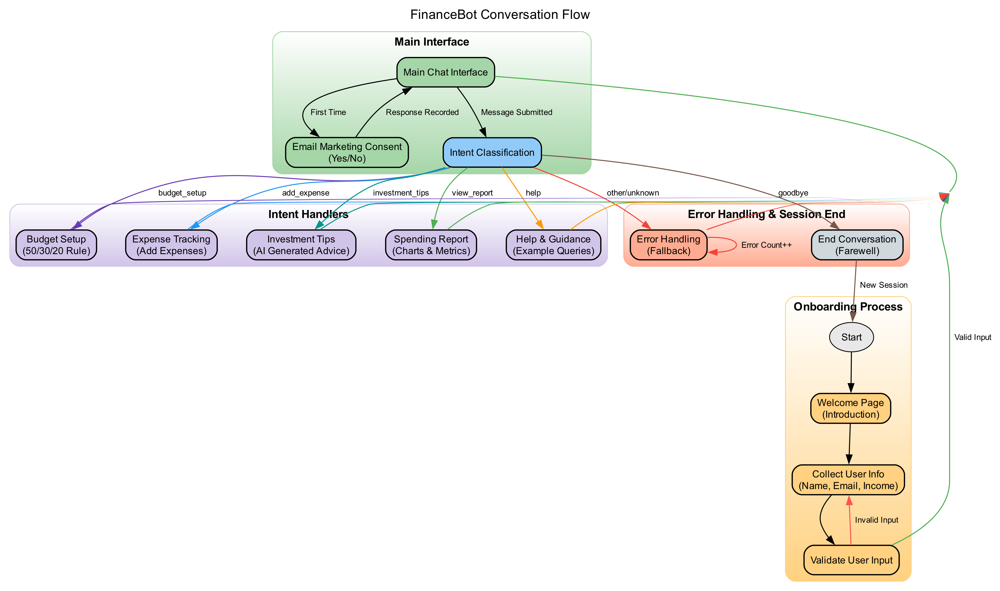

# FinanceBot

> **Quick Links**: These links provide direct access to the project's code and demonstration:
> - [**Code Labs**](https://codelabs-preview.appspot.com/?file_id=1ncClocUtFE5lYaZge129oi4OgcQbVCJCnjwcLuDUv8k/edit?tab=t.5cpih9qtxm58#0): Documentation of the project
> - [**Demo Video**](https://example.com/financebot-demo): Watch a demonstration of FinanceBot in action

FinanceBot is your personal financial assistant designed to make money management simple and conversational. This Streamlit-based application bridges the gap between complex financial advice and everyday money decisions.

## Features

- **Personalized Budgeting**: Creates custom budget recommendations based on your income
- **Expense Tracking**: Log and categorize expenses to monitor spending habits
- **Financial Reports**: Visualize spending patterns with interactive charts
- **Investment Guidance**: Receive tailored investment advice based on your financial situation
- **Natural Conversation**: Interact with the bot as you would with a real financial advisor

## Architecture

FinanceBot is built on Streamlit and powered by GPT-4o, enabling real-time financial calculations and visualizations while maintaining a natural conversation flow. The application follows a layered architecture:

1. **User Layer**: End-user access point
2. **Frontend Layer**: Streamlit UI components
3. **Intent Classification Layer**: GPT-4o for message processing
4. **Processing Layer**: Specialized financial modules
5. **External Services**: Third-party API integrations
6. **Data Layer**: Session state for conversation context

.png)

## Installation

### Prerequisites

- Python 3.8+
- pip (Python package installer)

### Setup

1. Clone the repository:
   ```bash
   git clone https://github.com/yourusername/financebot.git
   cd financebot
   ```

2. Create and activate a virtual environment (optional but recommended):
   ```bash
   python -m venv venv
   source venv/bin/activate  # On Windows, use: venv\Scripts\activate
   ```

3. Install dependencies:
   ```bash
   pip install -r requirements.txt
   ```

4. Set up environment variables:
   Create a `.env` file in the root directory with the following variables:
   ```
   GITHUB_TOKEN=your_github_token
   OPENAI_API_KEY=your_openai_api_key
   ```

## Usage

1. Start the application:
   ```bash
   streamlit run app.py
   ```

2. Access the application in your web browser at `http://localhost:8501`

3. Complete the onboarding process by providing your name, email, and income

4. Interact with FinanceBot by asking financial questions or using the following commands:
   - "Help me create a budget"
   - "I want to track an expense"
   - "What investment tips do you have?"
   - "Show me my spending report"
   - "How should I save for retirement?"

## Application Flow

The application follows a structured conversation flow:

1. **Onboarding**: Collects user information for personalized recommendations
2. **Chat Interface**: Main interaction point for financial assistance
3. **Intent-Specific UI**: Displays forms, charts, and reports based on user intent
4. **Session Summary**: Provides financial tips and summary at the end of a session



## Security & Privacy

FinanceBot prioritizes user data protection:

- **Ephemeral Storage**: Data exists only for the duration of the user session
- **No Persistent Database**: By default, no long-term storage of financial data
- **Input Validation**: Prevents invalid data entry
- **Error Handling**: Gracefully manages API failures and unexpected inputs
- **Data Minimization**: Collects only information directly relevant to providing financial assistance

## Development

### Project Structure

```
financebot/
├── app.py                  # Main application file
├── requirements.txt        # Project dependencies
├── assets/                 # Image resources and diagrams
│   ├── chatgpt.png
│   ├── coingeck.png
│   └── financebot_*.png    # Architecture diagrams
├── structure/              # Additional structural components
└── .gitignore              # Git ignore file
```

### Testing

The application has been tested across various scenarios:

- Onboarding flow validation
- Intent classification accuracy
- Financial calculations correctness
- Error handling and recovery
- API integration reliability

## Features in Progress

1. **Financial Document Upload & Analysis**
   - PDF/CSV statement parsing from banks and credit cards
   - Receipt scanning for expense tracking

2. **Vector Database Integration**
   - Financial knowledge base with persistent memory
   - Personalized advice based on similar user profiles
   - Smart search across financial documents

3. **External API Integrations**
   - Real-time investment data with Airflow for updates
   - Tax filing preparation via tax software APIs


## Acknowledgments

- GPT-4o for advanced natural language processing
- Streamlit for the interactive web application framework
- CoinGecko API for cryptocurrency price data

---

Created by Sai Priya Veerabomma
